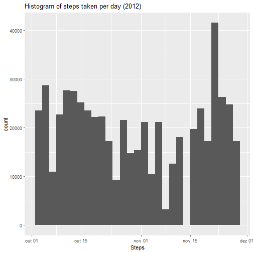
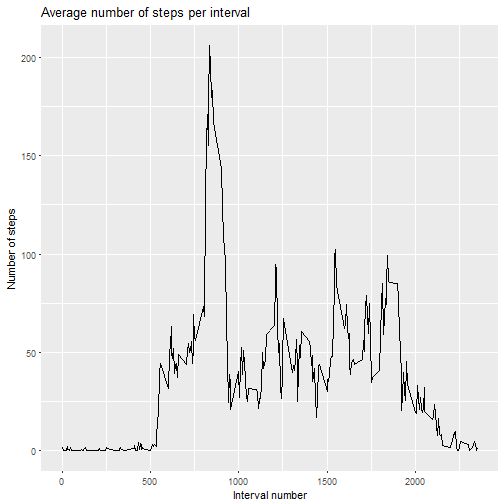
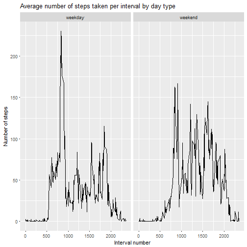

Reproducible Research - Course Project 1 by Caio Franco
=======================================================


This R markdown file follows the steps presented in the Assignment section on the README.md file.
ggplot2 as well as dplyr are necessary to run the scripts. So, first thing is loading those packages:

```r
library(ggplot2)
library(dplyr)
```

## 1. Loading and preprocessing the data

The data used in this assignment can be found [here]("https://d396qusza40orc.cloudfront.net/repdata%2Fdata%2Factivity.zip") and was accessed on April 24, 2017.

Firstly, we will download the zipped data from the provided url, unzip the csv file, read it into a variable and store its dates as Date.

```r
# Creating a temporary file
temp <- tempfile()

# Downloading zipped data set from the web
download.file("https://d396qusza40orc.cloudfront.net/repdata%2Fdata%2Factivity.zip", temp, mode="wb")
# Accessed on Apr. 24, 2017

# Unzipping the data and storing it to a variable
activity <- read.csv(unzip(temp))

# Freeing the temp file
remove(temp)

# Process data so dates will be of class Date 
activity <- mutate(activity,date=as.Date(date))
```

## 2. What is the mean total number of steps taken per day?

In order to answer that question, we will plot a histogram of total number of steps per day and
then calculate and report the mean and median total number of steps taken each day.

Let's start of with the code chunk to plot the histogram and its result:

```r
# Getting total steps per day
stepsByDate <- summarise(group_by(activity,date),sum(steps,na.rm=T))
names(stepsByDate)<- c("date","steps")

# Plotting histogram of number of total number of steps taken each day
Steps <- with(stepsByDate,rep(date,steps))
histogram <- qplot(Steps)+ggtitle("Histogram of steps taken per day (2012)")
print(histogram)
```



Now, we calculate and repot mean and median of the total number of steps taken per day

```r
stepReport <- summarise(stepsByDate, mean(steps), median(steps))
class(stepReport) <- "data.frame"
names(stepReport) <- c("mean","median")
stepsMean <- round(stepReport$mean,2)
stepsMedian <- stepReport$median
paste("Mean of total steps taken per day:", stepsMean, "Median of total steps taken per day:", stepsMedian, col=" ")
```

```
## [1] "Mean of total steps taken per day: 9354.23 Median of total steps taken per day: 10395  "
```

## 3. What is the average daily activity pattern?

To find an answer to the question above, one possible way is to plot each five minute interval average number of steps taken. That is what we will accomplish below:

```r
# Calculating mean steps taken per interval disregarding NAs
stepsByInterval <- summarise(group_by(activity,interval),mean(steps,na.rm=T))
names(stepsByInterval)<- c("interval","steps")

# Plotting interval average number of steps
plot <- ggplot(data=stepsByInterval, aes(interval,steps)) + geom_line() + 
        ggtitle("Average number of steps per interval") +
        xlab("Interval number") + ylab("Number of steps")
print(plot)
```



Which interval has the most steps? Let's see:

```r
mostStepsInterval <- stepsByInterval[which.max(stepsByInterval$steps),]
paste("Interval",mostStepsInterval$interval,"has the most steps on average with",mostStepsInterval$steps,"steps",col=" ")
```

```
## [1] "Interval 835 has the most steps on average with 206.169811320755 steps  "
```

## 4. Inputting missing values
Aiming to take a look at the impact of missing values, we will plot the histogram of steps taken per day, but taking into consideration the missing values. We will use the mean of steps taken in the given interval to fill NAs.

Let's calulate the number of missing values:

```r
paste("Missing values: ",sum(is.na(activity$steps)),col="")
```

```
## [1] "Missing values:  2304 "
```

Now, we will replace missing values with average number of steps for each interval

```r
# Creating new data set to be completed
fullyFilledActivity <- activity

# Completing data set with average value for interval
tempAct <- mutate(fullyFilledActivity, index=rep(1:288,61))
tempAct[is.na(tempAct$steps),]$steps <- stepsByInterval$steps[tempAct[is.na(tempAct$steps),]$index]
fullyFilledActivity <- tempAct
```

Having replaced all NAs with its interval average number of steps, we shall examine the new daily average of steps taken by plotting the histogram of average number of steps taken each day 

```r
# Getting total steps per day taking into account recent inputs 
stepsByDateFilled <- summarise(group_by(fullyFilledActivity,date),sum(steps,na.rm=T))
names(stepsByDateFilled)<- c("date","steps")

# Plotting histogram of number of average number of steps taken per day considering replacements for NAs
Steps <- with(stepsByDateFilled,rep(date,round(steps)))
histogram <- qplot(Steps)+ggtitle("Histogram of steps taken per date with input values")
print(histogram)
```


To look even further into the difference the replacement of missing values from the data set can make, we can check the new mean and median below:

```r
stepReportFilled <- summarise(stepsByDateFilled, mean(steps), median(round(steps)))
class(stepReportFilled) <- "data.frame"
names(stepReportFilled) <- c("mean","median")
stepsMeanwReplace <- round(stepReportFilled$mean,2)
stepsMedianwReplace <- stepReportFilled$median
paste("Mean of total steps taken per day:", stepsMeanwReplace, "Median of total steps taken per day:", stepsMedianwReplace, col=" ")
```

```
## [1] "Mean of total steps taken per day: 10766.19 Median of total steps taken per day: 10766  "
```

## 5.Are there differences in activity patterns between weekdays and weekends?

A good way to pursue an answer to this particular question relies on plotting the average number of steps taken in each interval whilst separating the patterns for weekdays and weekends. However first we have to modify the activity data set to include a factor variable that will indicate the type of day.

```r
# Creating a fla for weekends
weekendsFlag <- weekdays(activity$date) %in% c("sábado","domingo")

# Setting a weekday vs weekend factor
dayType <- factor(c("weekday","weekend"))
dayType[which(weekendsFlag)] <- "weekend"
dayType[which(!weekendsFlag)] <- "weekday"

# Creating new data set with day type flag
weekAct <- mutate(fullyFilledActivity,type = dayType)
```

Finally, with the data set sorted out, let's plot the average number of steps in each interval by day type.

```r
# Calculating mean steps taken per interval by day type using replaced missing values data set
stepsByIntervalAndType <- summarise(group_by(weekAct,interval, type),mean(steps,na.rm=T))
names(stepsByIntervalAndType)<- c("interval","type","steps")

plot <- ggplot(data=stepsByIntervalAndType, aes(interval, steps)) + geom_line() +
        facet_grid(.~type) +
        ggtitle("Average number of steps taken per interval by day type") +
        xlab("Interval number") +
        ylab("Number of steps")
print(plot)
```


